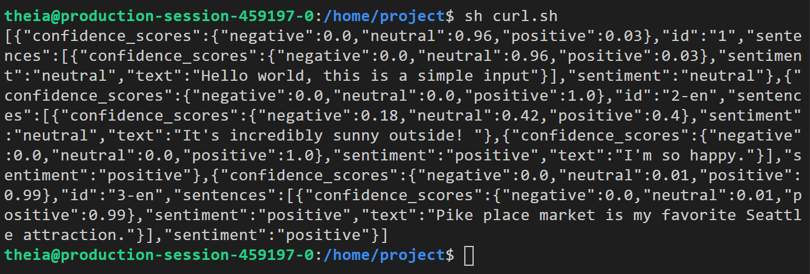

# Deploying a Containerized Text Analytics Solution with Azure AI

## Lab Steps
1. Logging in to the Microsoft Azure Portal
2. Create an Azure Container App Resource for Text Analytics Container
3. Analyzing Data using Azure AI Serive Hosted on Container App

## Description
Azure Text Analytics is a cloud-based service that provides advanced natural language processing over raw text, and includes four main functions: sentiment analysis, key phrase extraction, language detection, and entity recognition. It supports various SDKs and REST APIs to process text data and extract insights which helps build scalable and intelligent applications.

Azure AI Service combined with container solutions provides a flexible and scalable way to deploy and manage the service. It also provides the ability to scale the service based on the demand and requirements of the application.

You will learn how to deploy a containerized application that uses Azure AI Services Text Analytics to analyze text data in this hands-on lab.

## Learning objectives
Upon completion of this beginner-level lab, you will be able to:
- Deploy a text analytics containerized app on Container Apps
- Work with AI Service keys and endpoints
- Analyze text data using Azure Cognitive Service hosted on a container app

## Reference
https://platform.qa.com/lab/deploy-containerized-text-analytics-solution-azure-ai/

## Screenshot

